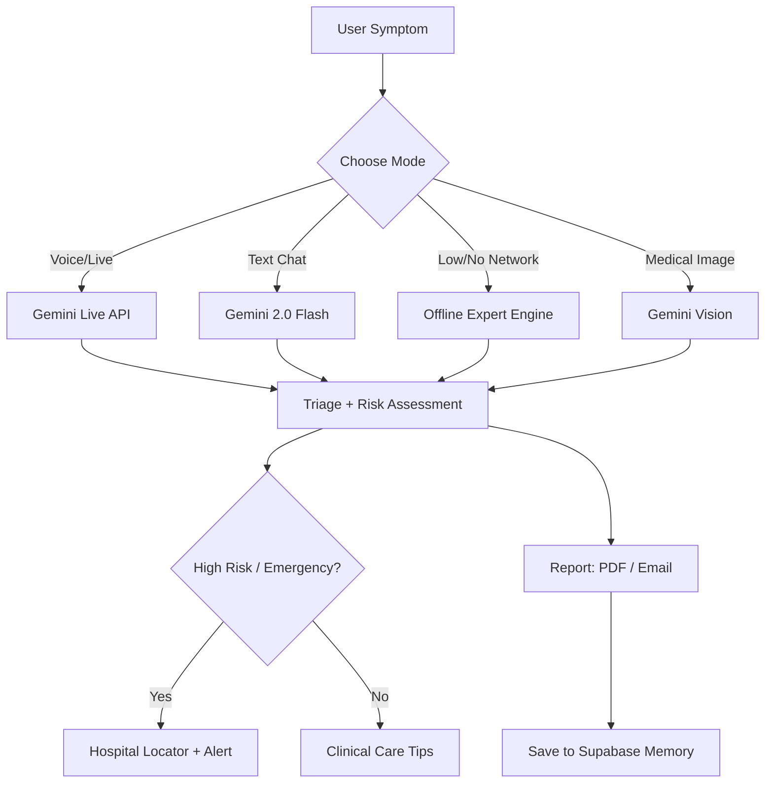

# 🏥 SymptomSage AI

### *The Intelligent First Responder for Modern Healthcare*

An AI-powered, conversational health assistant that provides early medical guidance and triage — bridging the gap between symptom onset and a professional consultation. Works with **text, voice, and medical images**, and keeps working **offline** when the network drops.

> ⚠️ **Disclaimer:** SymptomSage AI is for informational purposes only and does **not** constitute a medical diagnosis. Always consult a qualified healthcare professional.

---

## ✨ Key Features

| Feature | Description |
|---|---|
| 🎙️ **Conversational AI Triage** | Natural-language symptom chat powered by Google Gemini 2.0 Flash — generates follow-up questions, risk levels, and structured clinical reports. |
| 🔴 **Live Voice Mode** | Real-time bidirectional audio via the Gemini Live API + WebRTC. |
| 🧠 **Offline Expert Engine** | Fully offline, rule-based triage (`assessmentEngine.ts`) — no ML, no API. Red-flag detection, condition scoring, test suggestions. |
| 👁️ **Medical Image Analysis** | Gemini Vision analyses rashes, wounds, and skin conditions. |
| 📍 **Hospital & Facility Locator** | Google Maps Places API finds nearby hospitals, clinics, doctors, labs, and pharmacies — matched to recommended tests. |
| 📋 **Clinical Report + PDF + Email** | Structured report generation with PDF export and SMTP email delivery. |
| 🗄️ **Long-Term Patient Memory** | Per-user session history in Supabase, injected into future consultations. |
| 🤖 **3D Character with Lip-Sync** | Anime/robot character that reacts (idle / listen / speak) in sync with TTS audio. |
| 🔐 **Auth** | Clerk (Google OAuth + email/password). |

---

## 🏗️ Architecture

```
┌──────────────────────────────────────────────────────────┐
│  React 19 SPA (Vite + TypeScript + Tailwind)              │
│  Dashboard · Chat · Voice · Image · Hospital · Reports    │
└───────────────┬──────────────────────────────────────────┘
                │
        ┌───────┴────────┐
        ▼                ▼
┌──────────────┐  ┌──────────────────────┐
│ Node/Express │  │  (Planned) Python    │
│  server/     │  │  LangGraph agent     │
│  • summarize │  │  services/agent/     │
│  • image AI  │  │  • triage · vision   │
│  • email     │  │  • memory · places   │
└──────────────┘  └──────────────────────┘
        │                │
        └───────┬────────┘
                ▼
   Gemini 2.0 Flash · Supabase · Google Maps · SMTP
```

### Workflow



---

## 🛠️ Tech Stack

| Layer | Technology |
|---|---|
| AI Engine | Google Gemini 2.0 Flash (`gemini-2.0-flash-exp`) |
| Frontend | React 19 · Vite · TypeScript · Tailwind CSS |
| Voice | WebRTC · Gemini Live API |
| Backend (Node) | Node.js · Express · Nodemailer |
| Agent (planned) | Python · LangGraph · LangChain · FastAPI |
| Auth | Clerk |
| Database | Supabase (PostgreSQL) |
| Maps | Google Maps Places API |
| 3D / Animation | @react-three/fiber · @react-three/drei · three · framer-motion |
| Local LLM fallback | Ollama |
| Infra | Docker · Google Cloud Run · Cloud Build |

---

## 🚀 Quick Start

See **[`RUN.md`](./RUN.md)** for the full step-by-step setup (frontend, backend, agent, Docker).

### TL;DR

```bash
# 1. Install deps
npm install

# 2. Configure env
cp .env.example .env.local       # frontend
cp .env.example server/.env      # backend

# 3. Run frontend + backend (two terminals)
npm run dev                      # Vite frontend (5173)
npm run server                   # Express backend (3001)

# 4. (Optional) Agent service — see services/agent/
```

---

## 📂 Project Structure

```
.
├── components/         UI layer (Dashboard, ImageAnalysis, Hospital, 3D character…)
│   └── assessment/     Offline symptom checker components
├── views/              View containers (OfflineAssessmentView…)
├── utils/              assessmentEngine, supabase, places, location, audio, ollama
├── data/               symptoms.json, conditions.json, tests.json, redflags.json
├── server/             Node/Express backend (summarize, image, email)
├── services/agent/     (Planned) Python LangGraph agent service
├── Dockerfile          Multi-stage build (frontend + node server)
├── docker-compose.yml  Local multi-service orchestration
└── cloudbuild.yaml     GCP Cloud Build CI/CD
```

---

## 🤝 Credits

Built by **Sujal Jadhav**. See commit history for contributors.

## 📄 License

[MIT](./LICENSE)
