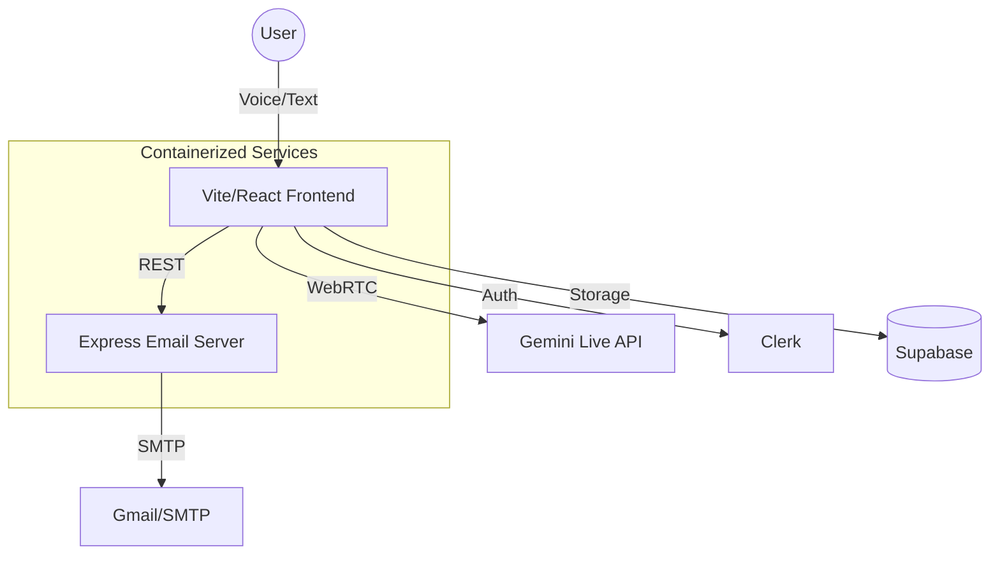

# 🏥 SymptomSage AI: The Future of Autonomous Triage

[](https://deepmind.google/technologies/gemini/)
[](https://react.dev/)
[](https://www.docker.com/)
[](https://cloud.google.com/)

> **Bridging the gap between patient and provider with real-time, AI-driven clinical triage.**

SymptomSage AI is a next-generation medical assessment platform designed for hackathons and high-scale health-tech requirements. It combines the power of **Google Gemini 2.0 Flash** with real-time voice interaction and offline-first logic to ensure healthcare is accessible to anyone, anywhere—even without a stable internet connection.

---

## 🌟 Core Features

### 🎙️ Real-time Voice Consultation
Experience a natural, voice-guided medical intake. Powered by **Gemini Live**, the system listens, transcribes, and responds in real-time, simulating a human-like preliminary conversation with a clinician.

### 📄 Autonomous Clinical Reports
At the end of every session, SymptomSage generates a professional-grade clinical report. It extracts:
- **Severity Score** (Low to Emergency)
- **Clinical Summary**
- **Recommended Immediate Precautions**
- **Suggested Diagnostic Tests**
- **Clinical Differentiators**

### 📶 Low Network (Offline) Mode
Critical healthcare shouldn't depend on high-speed internet. Our **Offline Expert System** uses a local rule-based engine to analyze symptoms and provide triage advice when connectivity disappears.

### 🔍 Multimodal Analysis
- **Image Analysis**: Detect rashes, wounds, or skin irregularities using Gemini's vision capabilities.
- **Hospital Locator**: Integrated Google Maps API to find the nearest medical facilities instantly when emergency symptoms are detected.

---

## 🛠️ Technology Stack

| Layer | Technology |
|---|---|
| **AI / Intelligence** | Gemini 2.0 Flash, Google GenAI SDK |
| **Real-time Voice** | WebRTC, Simli AI Avatar integration |
| **Frontend** | React 19, Vite, Tailwind CSS, Framer Motion |
| **Backend** | Node.js (Express), Nodemailer |
| **Authentication** | Clerk Auth |
| **Database** | Supabase |
| **Cloud / DevOps** | GCP (Cloud Run, Cloud Build), Docker, Nginx |

---

## 🏗️ System Architecture



---

## 🚀 Getting Started

### 1. Local Development
```bash
# Clone the repo
git clone https://github.com/mohit45v/Symptomsage-ai.git

# Install dependencies
npm install

# Set up environment variables
cp .env.local.example .env.local # Update your keys here

# Run services
npm run dev    # Start Frontend
npm run server # Start Email Backend
```

### 2. Docker & Orchestration
Run the entire stack (Frontend + Backend) locally with Docker:
```bash
docker-compose up --build
```

---

## ☁️ GCP Deployment (Step-by-Step)

SymptomSage is optimized for **Google Cloud Run**. Follow these three steps to go live:

1.  **Build & Push**:
    ```bash
    ./deploy_gcp.sh
    ```
2.  **Verify**: Access the provided URL from Cloud Run logs.
3.  **Monitor**: Use Google Cloud Logging to track clinical interaction health.

---

## 🚨 Medical Disclaimer
**SymptomSage AI is for informational purposes only.** It is not a medical diagnostic tool and does not constitute professional medical advice, diagnosis, or treatment. **In case of an emergency, please contact your local emergency services (e.g., 911) immediately.**

---

## 📄 License
This project is developed for hackathon purposes. All rights reserved.

<div align="center">
  <br/>
  Made with ❤️ by the SymptomSage Team
</div>
