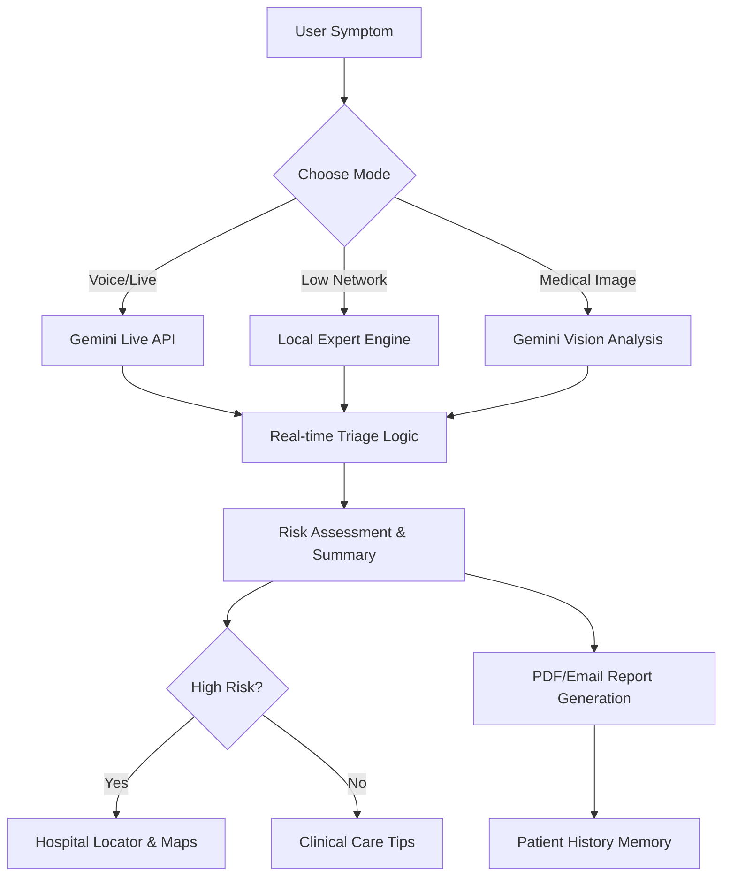

# 🏥 SymptomSage AI
### *The Intelligent First Responder for Modern Healthcare*

---

## 🟦 Team & Product
**Product Name:** SymptomSage AI  
**The Mission:** An AI-powered, conversational health assistant that provides early medical guidance, helping patients bridge the gap before professional consultation.

### **Core Promise**
- ⚡ **Fast & Fluid:** Instant responses to critical health inquiries.
- 🕒 **Always Available:** 24/7 access to medical logic.
- 📶 **Network Resilient:** Accessible even in low-network or offline conditions.

**Built With:**
- 🔹 **Google Gemini 2.0 Flash** (Model: `gemini-2.0-flash-exp`)
- 🔹 **Google Cloud Ecosystem** (Cloud Run, Artifact Registry, Maps API)

---

## ⚠️ The Core Problem
Healthcare accessibility is broken by three main barriers:
1.  **Patient Confusion:** Users don't know the severity of their symptoms or if immediate action is needed.
2.  **Delayed Access:** Doctors are rarely available for "instant" triage, and clinics can be far.
3.  **Inflexible Apps:** Most existing health apps are slow, text-heavy, and fail without a strong internet connection.

---

## 🔄 System Workflow

---

## 🚀 Innovation: The "Google Solution"

### 🎙️ 1. Conversational AI
We've replaced static forms with a **Real-Time Doctor-Patient Dialogue**.
- **The Tech:** Gemini Live API & Google AI Studio.
- **Outcome:** The AI understands symptoms via voice/text, generates logical follow-up questions, and maintains a natural consultation flow.

### 🧠 2. Severity & Medical Reasoning
Trust is built on explanation.
- **The Tech:** Gemini Reasoning Engine.
- **Outcome:** SymptomSage assigns risk scores (**Emergency | High | Medium | Low**) and—most importantly—**explains why**, providing traceable logic for its guidance.

### 📋 3. Smart Report Generation
Actionable data is better than general advice.
- **The Tech:** Gemini & Cloud Run.
- **Outcome:** Converts voice conversations into structured clinical reports, including recommended tests and immediate precautions.

### 📍 4. Location-Based Guidance
Closing the loop between AI and the real world.
- **The Tech:** Google Maps API & GCP Infrastructure.
- **Outcome:** When high-risk symptoms are detected, the system immediately fetches nearby hospitals, doctors, and labs.

### 📡 5. Low Network & Offline Support
Healthcare for the "Next Billion" users.
- **The Tech:** Optimized prompt strategy & Offline Expert System.
- **Outcome:** Works during travel, in rural areas, or during emergencies where data is unstable.

---

## 🏗️ Deployment & Cloud Architecture
We use a **Fully Serverless** architecture to ensure zero maintenance and infinite scalability.

- **Google Cloud Run:** Hosts our containerized Backend and Frontend services.
- **Cloud Build:** Automates our CI/CD pipeline from GitHub to Production.
- **GCP Credits:** Powerfully utilized to host high-performance APIs and AI calls efficiently.

---

## 🔮 Advanced Capabilities
- 👁️ **Multimodal Analysis:** Understands medical images (rashes, wounds) alongside text history.
- 📈 **Long-Term Memory:** Learns from previous health reports to make future conversations more personalized and accurate.
- 🎯 **UI Rendering:** Uses structured JSON output from Gemini to render a clean, professional dashboard.

---

## 🏆 USP: Why SymptomSage?
**"A Google-powered, real-time conversational health assistant that guides users to the right medical action — fast, explainable, and reliable even with low internet."**

---

## 🛠️ Tech Highlights
- **AI Engine:** Google Gemini 2.0 Flash (Exp)
- **Voice System:** WebRTC / Live Audio Streaming
- **Maps:** Google Maps Places SDK
- **Backend:** Node.js Express on Cloud Run
- **Frontend:** React 19 / Vite / Tailwind
- **Infrastructure:** Docker / GCP Cloud Build

---

## 📂 Project Structure
- `/components`: UI Layer (Dashboard, Voice Triage, Image Analysis)
- `/server`: Node.js Backend for Email & GCP integration
- `/utils`: AI orchestration and Offline Engine logic
- `/views`: Specialized view containers
- `/Dockerfile`: Consolidated multi-stage container build

  Made for the Google AI Hackathon 2024

